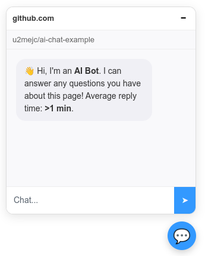
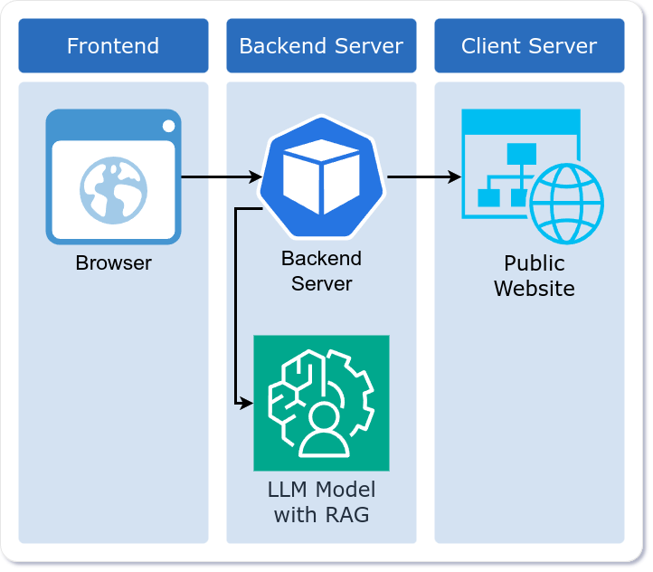

# ai-chat-example
An example of an emendable AI chat window that is able to share the webpage to
a LLM, for local RAG (Retrieval-Augmented Generation) context.

## Repo Layout
This mono repo contains the apps required to create a working example.

## Example 30,000 Foot View Diagram

